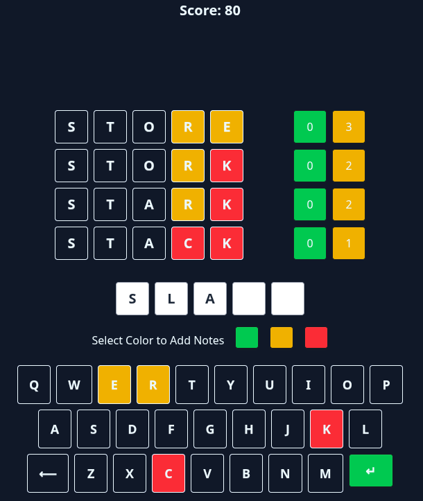

# Jotto

A server-rendered word game built with Django and HTMX.

<p align="center">
  
</p>

This project explores backend-driven UI patterns where application state lives on the server and interactivity is handled through incremental HTML updates instead of a heavy client-side SPA framework.

---

## Overview

Jotto is a simple word game implemented to demonstrate:

- Server-managed application state
- HTMX-driven partial template updates
- Minimal client-side JavaScript
- Clean Django application structure

The goal was to show that modern interactive web applications can be built with clarity and maintainability using server-side rendering.

---

## Architecture Notes

- Game state validated and managed server-side
- Incremental UI updates using HTMX `hx-*` attributes
- Redis-backed session storage (if enabled)
- TailwindCSS + DaisyUI for styling
- No custom frontend framework

This project emphasizes backend ownership of logic and predictable state transitions.

---

## Why Server-Driven UI?

Modern web development often defaults to heavy client-side frameworks.
This project explores an alternative approach:

- Business logic lives entirely on the server
- The browser is a thin rendering layer
- State transitions are explicit and testable
- HTMX enables interactivity without duplicating logic client-side

This results in a simpler mental model, fewer synchronization bugs,
and a backend-owned architecture that scales with complexity.

---

## Tech Stack

- Python
- Django
- HTMX
- Redis
- TailwindCSS

---

## Running Locally

```bash
git clone https://github.com/dtamez/jotto
cd jotto
python -m venv venv
source venv/bin/activate
pip install -r requirements.txt
python manage.py migrate
python manage.py runserver
